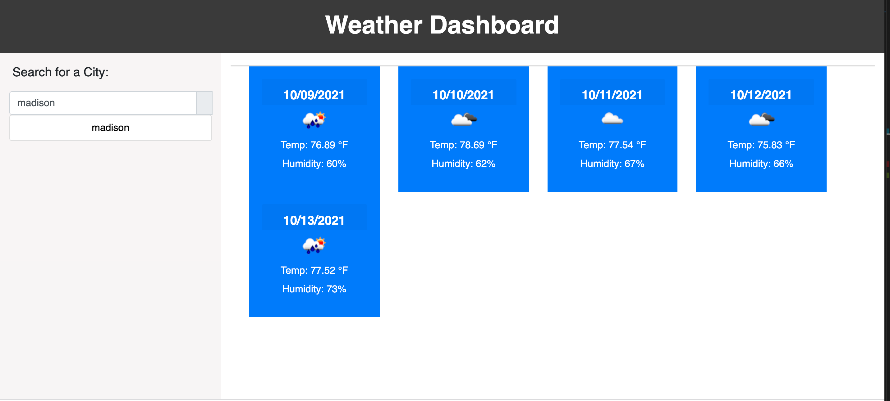

In this assignment, I was tasked with making a weather dashboard that would search a five day weather forecast using the onecall weather api. I had some difficulty, but I was able to create a website that would generate a 5 day forecast for any city the user might search. Upon typing in your city and clicking the grey button next to the search input, you will find your forcast!
https://ethanfregien2233.github.io/weather-dashboard2/
https://github.com/ethanfregien2233/weather-dashboard2
